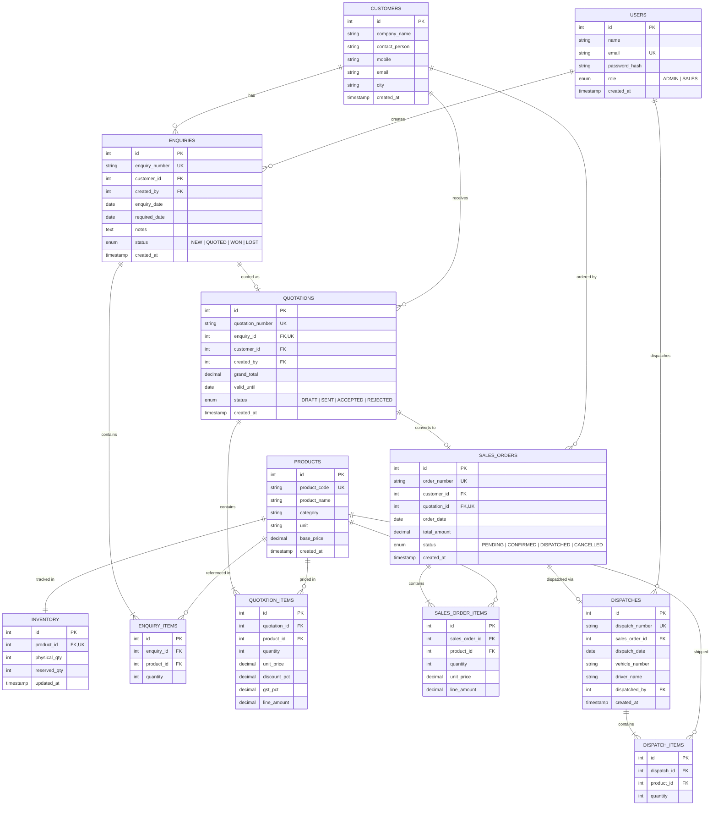

# PERN Mini ERP Entity Relationship (ER) Data Model

## Relational Architecture in PostgreSQL (`schema: pern_erp`)

## Concurrency & Integrity Mechanics
- **Pessimistic Row-Locking (`SELECT ... FOR UPDATE`):** When confirming orders or dispatching items, product inventory rows are locked ordered ascending by `product_id` to prevent concurrent race conditions and deadlocks.
- **Available Inventory Computation:**
  $$\text{Available Stock} = \text{Physical Quantity} - \text{Reserved Quantity}$$
- **State Transition Safeguards:**
  - Quotations in `DRAFT` or `REJECTED` cannot be converted to Sales Orders.
  - Unique constraint on `quotation_id` in `sales_orders` prevents double conversion.
  - Only `CONFIRMED` orders with reserved stock can be dispatched.
